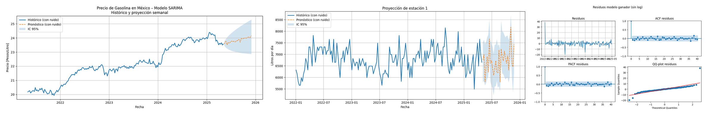
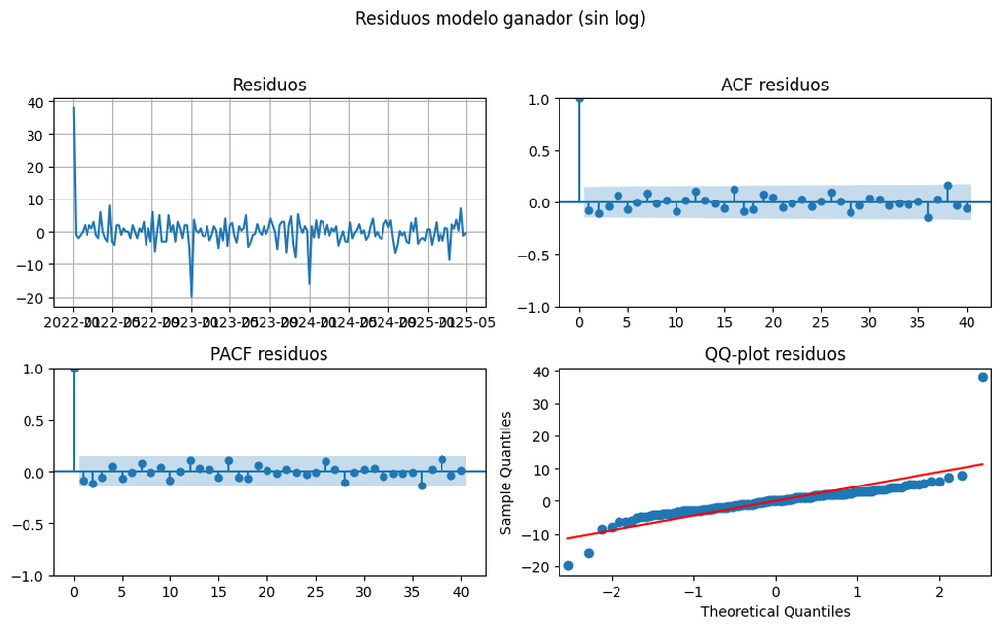
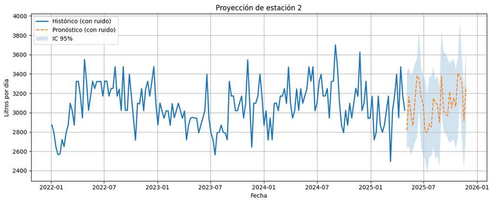
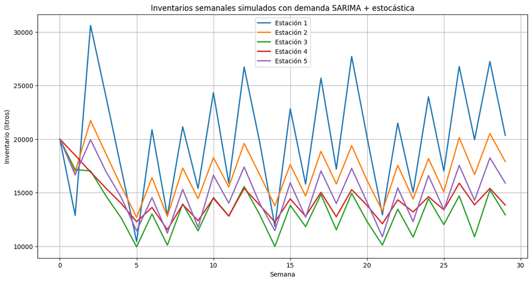
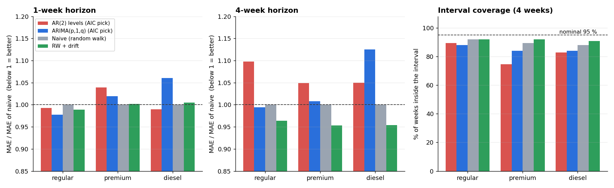
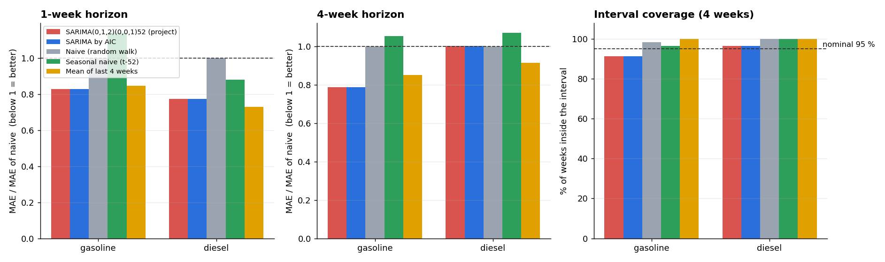

# SARIMA Fuel Demand and Price Forecasting

**Weekly demand and price forecasts for a five-station fuel retailer**, fitted by AIC grid search, validated on residuals, and delivered as a distribution — mean path plus a 95 % interval — so the downstream inventory and cash-flow optimization can plan against uncertainty instead of a single number.



> Stochastic processes course project (Tec de Monterrey, December 2025), run consulting-style with PhaiMat Labs for an operator with five service stations. **My contribution was the stochastic demand and price module described here**; teammates built the supply-chain and cash-flow optimization that consumes these forecasts. Full report and slides (Spanish) in [`docs/`](docs).

## The problem

Fuel retail has thin margins and volatile prices. Refill too early and you tie up cash in inventory; refill too late and a station runs dry. Both mistakes come from the same gap: the operator's planning used average consumption, with no notion of how wrong that average can be.

So the module has to answer, per station and per week: **how much fuel will be sold, and what is the plausible range?**

## Approach

**Why SARIMA.** Daily demand was first modeled as an Ornstein–Uhlenbeck process — mean-reverting, Gaussian, Markov, with a stationary limiting distribution. That captures the mean reversion but not the calendar: fuel sales have weekly and seasonal structure and a trend. SARIMA(p,d,q)(P,D,Q)ₛ keeps the autoregressive idea and adds explicit differencing and seasonality:

```math
\phi_p(L)\,\Phi_P(L^s)\,(1-L)^d (1-L^s)^D\, y_t = \theta_q(L)\,\Theta_Q(L^s)\,\varepsilon_t
```

**Order selection by AIC.** Instead of reading orders off ACF/PACF plots by eye, the code grid-searches the candidate orders and keeps the lowest AIC = −2 ln L + 2k, which trades fit against parameter count. Orders are searched **once**; after that the coefficients are fixed, so new forecasts are cheap — which matters because the optimization layer re-runs them per station.

Fitted models (maximum likelihood, weekly series, last 4 years):

| Series | Model found | Coefficients | σ_ε |
|---|---|---|---|
| Regular gasoline demand | MA(2) + seasonal MA(1) | θ = [−0.949, 0.157], Θ = [−0.210] | 2.096 |
| Regular gasoline price | AR(2) | φ = [1.350, −0.349] | 0.074 |
| Premium gasoline price | AR(2) | φ = [1.450, −0.450] | 0.051 |
| Diesel price | AR(2) | φ = [1.394, −0.393] | 0.053 |

**Validation.** Residuals are checked before the model is used: they oscillate around zero with no visible trend, ACF and PACF stay inside the confidence bands, and the QQ-plot follows the normal line through the central region. The tails deviate — a handful of isolated spikes that read as one-off shocks rather than structure the model is missing.



**From national data to one station.** Demand comes from national/regional series (SENER) and prices from the regulator (CRE), then gets scaled to each station by the ratio of station daily average to regional daily average. On top of the mean path the model adds Gaussian noise ε ~ N(0, σ²), with σ estimated from historical variability, so each station's forecast is a band rather than a line:

```math
\hat y_t = \mu_t + \varepsilon_t, \qquad \varepsilon_t \sim \mathcal N(0,\sigma^2)
```



## What it feeds

The forecast is the input to the team's optimization layer: a supply-chain model that maximizes the time between refills subject to tank capacity and service-level constraints (decision variables: litres delivered per station Qᵢ, weeks until next refill T), and a multi-stage cash-flow model. Because demand arrives as a distribution, the refill plan can be sized for the 95 % case instead of the mean.



## Does it actually forecast? (out-of-sample check)

AIC only ranks models on the data they were fitted to. This section adds the test that was missing from the original project: **rolling-origin backtests** against trivial benchmarks, expanding window, for both halves of the module — prices first, then demand.

### Prices: the model does not beat a random walk



**1. The price series have a unit root.** ADF on levels does not reject non-stationarity (p = 0.73 / 0.58 / 0.87 for regular, premium, diesel); on first differences it rejects decisively (p < 0.001). Consistent with that, the AR(2) coefficients fitted in the project sum to ≈ 1.0005 — the model is a random walk in disguise, which is why its forecast path is nearly flat.

**2. Against a naive forecast, the model adds nothing.** Mean absolute error in MXN/L, 75 rolling origins:

| Series | h | AR(2) levels | ARIMA(p,1,q) | Naive (RW) | RW + drift |
|---|---|---|---|---|---|
| Regular | 1 week | 0.110 | **0.109** | 0.111 | 0.110 |
| Regular | 4 weeks | 0.235 | 0.213 | 0.214 | **0.206** |
| Premium | 1 week | 0.086 | 0.085 | **0.083** | **0.083** |
| Premium | 4 weeks | 0.205 | 0.197 | 0.196 | **0.187** |
| Diesel | 1 week | **0.086** | 0.092 | 0.087 | 0.087 |
| Diesel | 4 weeks | 0.186 | 0.199 | 0.177 | **0.169** |

At one week everything ties — differences under 3 % of MAE. At four weeks the **random walk with drift wins on all three fuels** and the AR(2) is the worst model. A weekly retail fuel price in Mexico is, for practical purposes, unpredictable beyond its own last value plus a trend.

**3. The 95 % intervals are too narrow.** At the four-week horizon the AR(2) interval covers 89 % (regular), 75 % (premium) and 83 % (diesel) of the realized prices instead of 95 %. The fat tails visible in the QQ-plot show up exactly where they hurt: the model is most confident precisely when it should not be.

### Demand: the model earns its place

The same test on the weekly demand series for Nuevo León ([`src/backtest_demand.py`](src/backtest_demand.py), 60 rolling origins, 2022–2025), against naive, seasonal-naive and a 4-week moving average:



| Series | h | SARIMA (project) | Naive | Seasonal naive | Mean of 4 weeks |
|---|---|---|---|---|---|
| Gasoline | 1 week | **2.48** (MAPE 6.1 %) | 3.00 | 3.42 | 2.54 |
| Gasoline | 4 weeks | **2.56** (MAPE 6.3 %) | 3.25 | 3.42 | 2.76 |
| Diesel | 1 week | 1.51 | 1.95 | 1.72 | **1.42** |
| Diesel | 4 weeks | 1.51 | **1.51** | 1.61 | 1.38 |

**On gasoline the SARIMA wins**: 17 % lower MAE than the naive forecast at one week and 21 % at four weeks, and it beats every benchmark including the moving average. Re-running the AIC search inside the backtest picks the same orders the project chose — MA(2) with a seasonal MA(1) — so the original model selection holds up. Gasoline demand is also the series the inventory optimization actually needs, and its interval coverage (90 % at h = 1, 91 % at h = 4) is close to nominal.

**On diesel it does not.** Diesel volume at this scale is small and noisy (MAPE ~45 %), and a plain 4-week average forecasts it better. That is worth knowing before sizing diesel refills off this model.


**What this changes.** The two halves of the module deserve different verdicts. For **prices**, a random walk with drift is the honest model and the SARIMA machinery buys nothing — weekly retail fuel prices in Mexico are close to unpredictable. For **gasoline demand**, which is what the inventory optimization consumes, the SARIMA is genuinely better than any trivial benchmark and its intervals are nearly calibrated. Diesel needs a simpler model. Running this test is what turns "the AIC was lowest" into "here is where the model helps and where it doesn't".


## Honest limitations

- **Refitting.** Coefficients are fixed after the AIC search. If the series drifts or a structural break hits (a price-policy change, a new competitor), the orders have to be searched again — the model does not adapt on its own.
- **Normal tails.** The 95 % interval assumes Gaussian errors; measured coverage is 75–89 % on prices (90–91 % on gasoline demand) instead of 95 %. Student-t innovations would be the direct fix.
- **Station scaling.** Each station is a scaled version of the regional series plus noise, not an independently modeled series; real station-level effects (local events, road work, a competitor's promotion) are not in the model.

## Repository

```
notebooks/sarima_fuel.ipynb   AIC search, fit, diagnostics, per-station forecast (Spanish comments)
src/backtest_prices.py        price backtest vs naive benchmarks + ADF tests
src/backtest_demand.py        demand backtest vs naive, seasonal naive and moving average
data/fuel_prices_weekly_MXN.csv   weekly national retail prices, May 2021 – May 2025 (CRE)
data/fuel_demand_weekly_NL.csv    weekly gasoline and diesel demand, Nuevo Leon 2022–2025 (SENER)
results/                      backtest metrics and ADF results (CSV)
docs/                         final report and slides (Spanish), README figures
```

The input `.xlsx` files are not published — they contain the client's station-level sales. The public sources are SENER (fuel demand) and CRE (retail prices).

## Stack

Python · pandas · NumPy · statsmodels (SARIMAX, ADF) · Matplotlib
